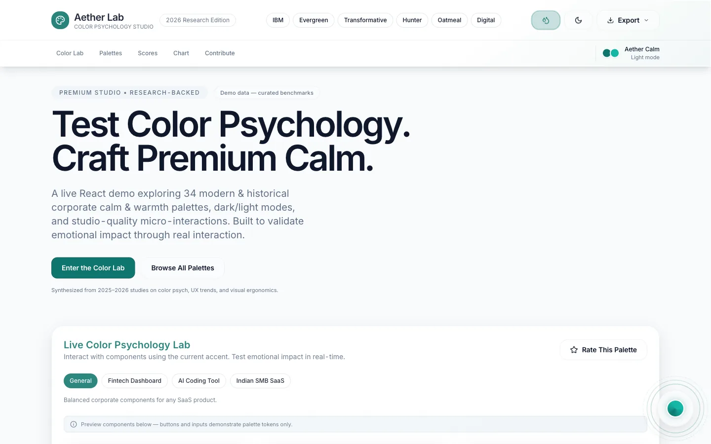
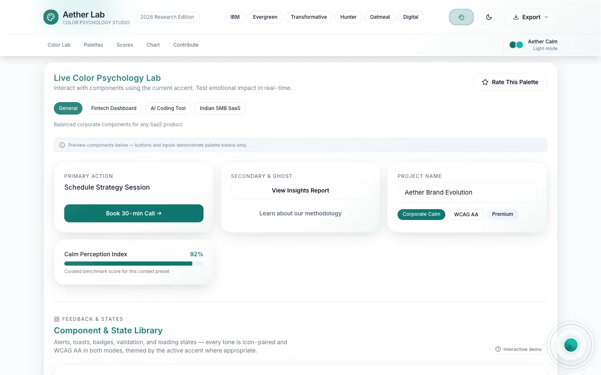
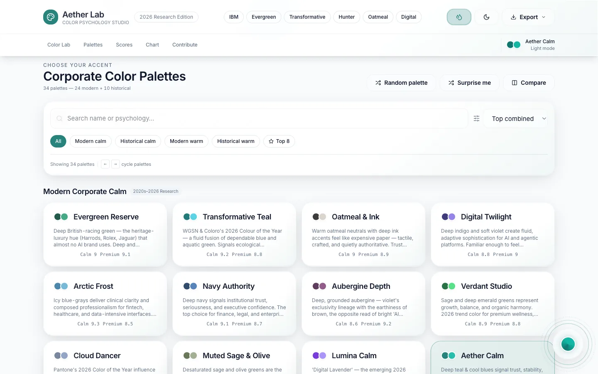
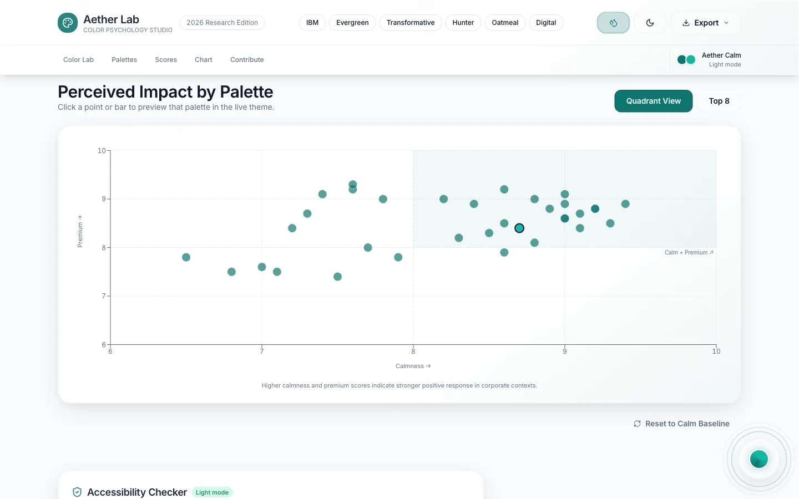
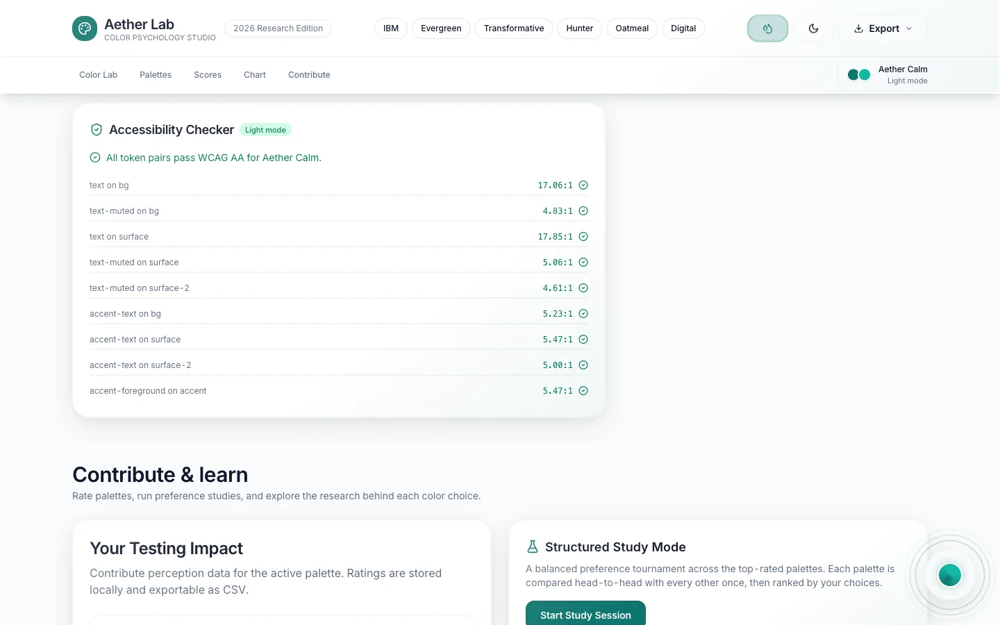
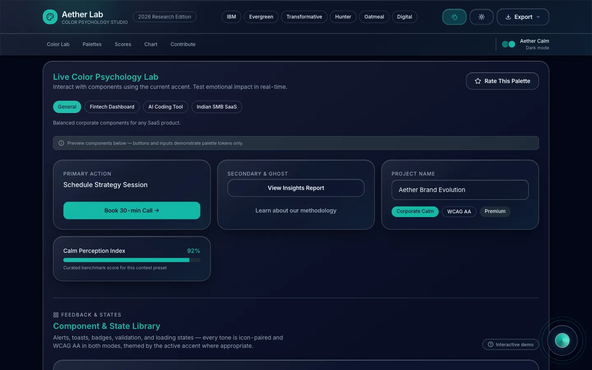

<div align="center">

# Aether Lab — Color Psychology UI Demo

### An interactive React studio for testing the emotional impact of corporate color palettes — with 34 research-backed themes, live WCAG-AA contrast auditing, and a Liquid Glass design system.

[](https://color-psych-ui.pages.dev)

[](https://react.dev)
[](https://www.typescriptlang.org)
[](https://vite.dev)
[](https://tailwindcss.com)
[](#-accessibility--contrast-ci)
[](./LICENSE)

</div>

<p align="center">
  <a href="https://color-psych-ui.pages.dev">
    
  </a>
</p>

> **TL;DR** — Aether Lab is a polished, single-page React demo that lets you *feel* how color choices change the perceived calm and premium quality of a corporate UI. Switch between 34 curated palettes, flip dark/light and Liquid Glass modes, run the components through four real-world product contexts, and verify that **every** token pair passes WCAG AA contrast — all in real time, with zero backend.

**🔗 Live demo: [color-psych-ui.pages.dev](https://color-psych-ui.pages.dev)**

---

## 📑 Table of Contents

- [Why this exists](#-why-this-exists)
- [Features](#-features)
- [Screenshots](#-screenshots)
- [The palette system](#-the-palette-system)
- [Accessibility & contrast CI](#-accessibility--contrast-ci)
- [Data honesty](#-data-honesty)
- [Tech stack](#-tech-stack)
- [Getting started](#-getting-started)
- [Available scripts](#-available-scripts)
- [Project structure](#-project-structure)
- [Deployment](#-deployment)
- [Contributing](#-contributing)
- [License](#-license)

---

## 💡 Why this exists

Color is one of the most powerful — and most hand-wavy — levers in product design. Teams argue about whether a brand feels "calm," "premium," or "trustworthy" without any way to *test* the claim on real components.

**Aether Lab turns that conversation into an experiment.** It renders a realistic SaaS interface — buttons, inputs, cards, badges, alerts, charts — and lets you repaint the entire surface with a research-backed palette in one click. Because the components are driven by [design tokens](https://www.w3.org/community/design-tokens/), swapping a theme instantly updates every element, so you can judge emotional impact *in context* instead of staring at color swatches.

It's built as a **portfolio-grade reference** for:

- 🎨 **Color psychology & branding** — compare modern (2020s–2026) vs. historical (1940s–1990s) corporate palettes for calm and warmth.
- ♿ **Accessible theming** — a token architecture where dark/light + 34 palettes all stay WCAG AA, enforced in CI.
- ⚛️ **Modern React patterns** — React 19, lazy-loaded charts, custom hooks, `localStorage` persistence, and a reusable feedback/state component library.
- 🪟 **Design-system craft** — a "Liquid Glass" material (macOS-style translucency, refraction, specular highlights) with a solid-surface fallback.

---

## ✨ Features

### 🧪 Live Color Psychology Lab
- Repaint a full SaaS UI with the active palette — primary/secondary/ghost actions, inputs, cards, and a benchmark meter.
- Four **context presets** — *General*, *Fintech Dashboard*, *AI Coding Tool*, *Indian SMB SaaS* — that reframe the copy and components for each product domain.
- A **Component & State library** (alerts, toasts, badges, inline validation, skeletons, progress, empty states) where every semantic tone is icon-paired and AA-legible in both modes.

### 🎛️ Palette browser & curation
- **34 palettes** across four families: modern calm, historical calm, modern warm, historical warm.
- Full-text **search**, category **filters**, **sorting**, and a **top-rated** toggle.
- **Shortlist** up to 25 palettes (persisted), then **compare** any two side-by-side in a light + dark modal.
- *Random palette*, *Surprise me*, and `←` / `→` keyboard navigation between themes (vertical scroll preserved).

### 📊 Data & insights
- **Perceived Impact** scatter/quadrant chart (calmness × premium) — click any point to preview that palette live.
- **Benchmark metrics** that blend curated scores with your own locally-stored ratings.

### ♿ Accessibility checker
- Live **WCAG AA contrast ratios** for every token pair in the active theme, recomputed on every palette/mode switch.

### 🤝 Contribute & study
- Rate palettes on calmness & premium feel; ratings are stored locally and **exportable as CSV**.
- **Structured Study Mode** — a balanced preference tournament (each candidate shown ~3×, then ranked) across your shortlist.
- A **research panel** summarizing the color-psychology rationale behind each choice.

### 🪟 Studio-grade UX
- **Liquid Glass** mode (translucency + saturation + specular edges) with a `prefers-reduced-transparency` fallback.
- **Dark / light** theming with system-preference detection.
- **Spectral Nexus HUD** — a floating radial control for quick palette/mode switching.
- **Export theme** as **CSS variables**, **JSON tokens**, or **Tailwind config** (copied to clipboard).
- Smooth Framer Motion micro-interactions, a skip-link, and `prefers-reduced-motion` support.

---

## 📸 Screenshots

| Live Color Psychology Lab | Palette browser (34 themes) |
| :---: | :---: |
|  |  |
| **Perceived Impact chart** | **Accessibility checker (WCAG AA)** |
|  |  |

<p align="center">
  
  <br><em>Dark mode + Liquid Glass — the same token-driven UI, re-themed instantly.</em>
</p>

---

## 🎨 The palette system

Themes are plain design-token objects (`light` / `dark` CSS-variable maps), so the whole app re-skins from a single source of truth:

| Family | Era | Mood |
| --- | --- | --- |
| Modern Calm | 2020s–2026 research | Cool, trustworthy, low-arousal |
| Historical Calm | 1950s–1990s classics | Heritage, institutional calm |
| Modern Warm | 2020s–2026 research | Energetic, approachable warmth |
| Historical Warm | 1940s–1980s classics | Nostalgic, earthy warmth |

Each palette ships **light and dark** variants and exposes the same token contract (`--bg`, `--surface`, `--surface-2`, `--text`, `--text-muted`, `--accent`, `--border`, …), which is exactly what keeps theming swappable *and* accessible.

> 📚 The reasoning behind each palette — and recommended starting points per industry — lives in **[RESEARCH_AND_STRATEGY.md](./RESEARCH_AND_STRATEGY.md)**.

---

## ♿ Accessibility & contrast CI

Accessibility isn't a screenshot here — it's enforced. The repo ships a contrast auditor that runs in CI and locally:

```bash
pnpm audit:contrast
```

It validates **two layers** on every palette × mode — **612 palette-token + 544 semantic-token checks** across all 34 palettes:

1. **Per-palette token pairs** — text/accent on `bg` / `surface` / `surface-2`.
2. **Global semantic feedback tokens** — `--info` / `--success` / `--warning` / `--danger` and their muted fills, used by alerts, badges, and inline validation.

Two invariants keep the guarantee airtight across every theme:

- **Brand-safe accent tokens** — `--accent` always keeps the true brand color; a derived `--accent-text` guarantees ≥ 4.5:1 for accent-colored *text*.
- **Tone-owned grounds** — semantic tone text is always rendered on its own tone ground (never the bare palette surface), so a single global color can't silently drop below 4.5:1 on a warm or dark palette.

Run `pnpm fix:contrast` to derive `--accent-text` and repair muted/foreground tokens — it never mutates the brand `--accent` / `--bg`.

---

## 🔍 Data honesty

- **Benchmark scores** (calmness / premium metrics, trust %, the impact chart) are **curated illustrative data** grounded in 2025–2026 research — not live analytics. The UI labels them as demo data.
- **Your ratings** are **real local contributions** stored in `localStorage` and exportable as CSV. Nothing is sent to a server — this app has no backend.

---

## 🧰 Tech stack

| Layer | Tooling |
| --- | --- |
| **Framework** | [React 19](https://react.dev) + [TypeScript](https://www.typescriptlang.org) |
| **Build** | [Vite 8](https://vite.dev) |
| **Styling** | [Tailwind CSS v4](https://tailwindcss.com) (via `@tailwindcss/vite`) + CSS custom-property design tokens |
| **Animation** | [Framer Motion](https://www.framer.com/motion/) |
| **Charts** | [Recharts](https://recharts.org) (lazy-loaded) |
| **Icons** | [lucide-react](https://lucide.dev) |
| **Toasts** | [sonner](https://sonner.emilkowal.ski) |
| **Testing** | [Vitest](https://vitest.dev) |
| **Linting** | [ESLint](https://eslint.org) + `typescript-eslint` |

No backend, no database — all state lives in the browser (`localStorage`).

---

## 🚀 Getting started

**Prerequisites:** [Node.js](https://nodejs.org) **22** (see [`.nvmrc`](./.nvmrc)) and [pnpm](https://pnpm.io). npm/yarn work too — pnpm is just what the lockfile uses.

```bash
# 1. Clone
git clone https://github.com/Aman-CERP/color-psych-ui-demo.git
cd color-psych-ui-demo

# 2. Use the pinned Node version (optional but recommended)
nvm use            # reads .nvmrc → Node 22

# 3. Install dependencies
pnpm install

# 4. Start the dev server
pnpm dev           # → http://localhost:5173
```

Then open the local URL and start swapping palettes. 🎨

---

## 📜 Available scripts

| Script | What it does |
| --- | --- |
| `pnpm dev` | Start the Vite dev server with HMR. |
| `pnpm build` | Type-check (`tsc -b`) and build the production bundle to `dist/`. |
| `pnpm preview` | Preview the production build locally. |
| `pnpm test` | Run the Vitest unit suite once. |
| `pnpm lint` | Lint the project with ESLint. |
| `pnpm audit:contrast` | Verify every palette × mode passes WCAG AA contrast. |
| `pnpm fix:contrast` | Derive `--accent-text` and repair muted/foreground tokens to satisfy the audit. |

---

## 🗂️ Project structure

```
color-psych-ui-demo/
├── src/
│   ├── components/        # UI: Header, ColorLab, PaletteGrid, charts, modals, HUD…
│   │   └── ui/            # Reusable feedback/state primitives (Alert, Badge, Tooltip,
│   │                      #   Skeleton, Progress, EmptyState) + the tone token system
│   ├── hooks/             # useTheme, useLiquidGlass, useShortlist, useUserRatings…
│   ├── data/              # The 34 palette definitions (light/dark token maps), scores
│   ├── utils/             # exportTheme, storage helpers, shortlist, progress, etc.
│   ├── index.css          # Design tokens, glass material, semantic feedback colors
│   └── App.tsx            # Page composition & state orchestration
├── scripts/
│   ├── audit-contrast.mjs # WCAG AA contrast CI
│   └── fix-contrast.mjs   # Derives --accent-text; never mutates brand --accent/--bg
├── docs/screenshots/      # Optimized WebP screenshots used in this README
├── RESEARCH_AND_STRATEGY.md   # The color-psychology research & palette guide
└── .nvmrc                 # Node 22 pin (matches the Cloudflare build image)
```

---

## 🌐 Deployment

The live demo runs on **[Cloudflare Pages](https://pages.cloudflare.com)** with Git-based continuous deployment:

- **Production URL:** https://color-psych-ui.pages.dev
- **Trigger:** every push to `main` builds and deploys automatically; branches/PRs get preview URLs.
- **Build command:** `pnpm run build` → output directory `dist`
- **Node version:** pinned to **22** via [`.nvmrc`](./.nvmrc) (Vite 8 requires Node ≥ 20.19 / 22.12).

Because the app is a fully static SPA, it can also be hosted on any static host (Netlify, Vercel, GitHub Pages, S3 + CDN) — just serve the contents of `dist/`.

---

## 🤝 Contributing

Issues and pull requests are welcome! If you add a palette, a semantic tone, or a new soft component, please keep tone text on a tone-owned ground and run `pnpm audit:contrast` before opening a PR so the accessibility guarantees hold.

---

## 📄 License

Released under the **[MIT License](./LICENSE)**.

<div align="center">

---

Built with React, Tailwind & a lot of color theory. ✦ **[Try the live demo →](https://color-psych-ui.pages.dev)**

</div>
